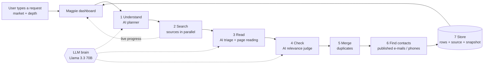

# Magpie - You ask, it collects

An AI-powered data intelligence platform that turns a plain-language business requirement into a clean,
structured, source-backed dataset, through a workflow the AI designs and runs on its own.

| | Link |
| --- | --- |
| **Live app** | [magpie-lake-iota.vercel.app](https://magpie-lake-iota.vercel.app/) |
| **Backend (health check)** | [magpie-9pln.onrender.com](https://magpie-9pln.onrender.com) |
| **Source code** | [github.com/23110572-hash/Magpie](https://github.com/23110572-hash/Magpie) |

> The backend runs on a free plan and sleeps when idle: the first request after a quiet period can take about
> a minute while it wakes up.

---

## 1. Problem statement

### AI-Powered Data Intelligence Platform

Businesses often need to collect specific information from the web, such as job openings, sales leads, sponsor
opportunities, market data, or other business-relevant information. However, building separate scrapers and
workflows for every requirement is time-consuming, difficult to maintain, and not scalable.

The challenge is to build an AI-powered data intelligence platform where users can describe what they need in plain
English. The AI should understand the request, dynamically create and execute an appropriate data-collection
workflow, gather information from permitted sources, process and validate the data, and present the results through
a centralized dashboard.

The platform should also allow users to manage collection tasks, monitor their progress, explore results, inspect
sources, revisit previous workflows, and export datasets.

**Goal** - build a prompt-based AI Data Intelligence Platform that can:

- Understand data requirements from natural-language prompts.
- Collect and process information from multiple permitted sources.
- Provide source-backed, traceable data.
- Present results through an interactive dashboard.
- Allow users to search, filter, and export collected data.

**Expected outcome**

- Dynamically design and execute data-collection workflows.
- Clean, structure, validate, and deduplicate results.
- Allow users to monitor and manage collection tasks.
- Maintain workflow and dataset history.

A complete product that turns a natural-language business requirement into a clean, structured, source-backed
dataset with a managed end-to-end workflow.

---

## 2. Our solution

Magpie has one input: a prompt box. The user types what they need in their own words (spelling mistakes, broken
grammar and Hinglish are all fine), picks a market (India, United States or European Union) and a depth
(Fast, Balanced, Deep). Magpie does the rest:

```
You type:        "mujhe chandigarh mein web developer chahiye"
Magpie reads:    "I need a web developer in Chandigarh"
Understood as:   Web developers (people) in Chandigarh, India
You get:         38 verified rows, 9 with an e-mail, each linked to its source and raw snapshot
```

There is no scraper per use case and no hardcoded list of cities, job titles or keywords. A large language model
acts as the brain: for every request it decides **what** to collect, **where** to look, **how** to read what it
finds and **what counts as a good result**. The same engine handles people to hire, job openings, local
businesses, companies, sponsors, events, news and market data.

**What the user gets**

- **Live workflow tracking** - a step-by-step progress bar (Understood, Searching, Reading pages, AI relevance check,
  Duplicates merged, Finding contacts, Saved) with a live percentage and time estimate. Runs can be cancelled.
- **"Understood as" with one-click correction** - the dashboard shows how the AI read the request and offers
  alternative readings (e.g. "search jobs instead of people") that re-run the workflow with one click.
- **Clean datasets** - every dataset gets columns chosen for that request (e.g. *skills, experience, portfolio* for
  developers; *services, rating* for agencies), a table and card view, search and filters, and CSV / JSON / PDF export.
- **Full provenance** - every row keeps its source link, collection time, why it matched, where else it was seen,
  and the exact raw data it was built from.
- **Honest contact coverage** - "Out of 79 rows, 29 have an e-mail and 36 have a phone number". Contacts are only
  kept when they are actually published by the source; nothing is guessed.
- **History and outreach** - every workflow and dataset is kept per user; runs can be re-opened, re-run or deleted.
  Selected rows become leads, and the AI drafts a personalised outreach e-mail.
- **Private workspaces** - real accounts; each user only sees their own workflows, datasets and leads.

---

## 3. How we solve it

Every request runs through the same seven-step workflow. The AI makes the decisions; the code enforces safety,
validation and traceability.

| Step | What happens |
| --- | --- |
| **1. Understand** | The AI rewrites the request in clear English, classifies what is wanted (people, jobs, companies, local businesses, events, news, market data), finds the place (city, region, country and its alternative spellings), lists synonyms that a relevant result must mention, chooses the dataset columns, writes the search queries and picks the sources. |
| **2. Search** | The chosen sources are queried in parallel, targeted to the selected market: Google web, Google Maps and Google News, Tavily AI search, GitHub developer profiles, the Adzuna job index, official company job boards (Greenhouse, Lever, Ashby), Remotive, Arbeitnow, Hacker News and Wikipedia. |
| **3. Read** | The AI looks at the web results and decides which ones are a single result, which are lists or directories worth reading, and which to skip. Magpie fetches the lists (respecting robots.txt) and the AI extracts every entry into the dataset columns. |
| **4. Check** | Every candidate is judged by the AI against the original request: right kind of thing, right place, filters satisfied. Each kept row gets a 0-100 score and a short reason. |
| **5. Merge** | The same person or business found through different sources becomes one richer row (matched by link, e-mail, phone, website, profile or name + organisation + place). |
| **6. Find contacts** | For the best rows, Magpie visits the result's own website and contact page and keeps only e-mails and phone numbers that are published there. |
| **7. Store** | Rows are saved with their source URL, timestamp and raw snapshot, and the contact coverage is calculated. |

**Principles we hold to**

- **No invented data.** URLs, e-mails and phone numbers suggested by the AI are only kept if they literally appear
  in the source. Placeholder values (e.g. `555 1234567`) are dropped.
- **Permitted sources only.** Official APIs and public pages; robots.txt is always respected, and sites whose terms
  forbid scraping (LinkedIn, Naukri, Instagram, Facebook and similar) are never fetched. Their public search-result
  listings can still appear as a lead, with the link.
- **Traceable by design.** Provenance is stored with the row, not reconstructed later.
- **Graceful degradation.** If one source or page fails, the workflow carries on and reports it.

---

## 4. Architecture



**Building blocks**

| Layer | Technology | Role |
| --- | --- | --- |
| Dashboard | React, TypeScript, Tailwind CSS | Prompt bar with market and depth, live progress tracker, datasets (table / cards), leads, history, settings |
| Workflow engine | Python, FastAPI, asyncio | Runs the seven steps in parallel and streams progress to the dashboard |
| AI brain | Meta Llama 3.3 70B via OpenRouter | Planning, page triage, extraction, relevance checking, outreach drafts |
| Web discovery | Serper (Google web, Maps, News), Tavily | Finding lists, directories, profiles and businesses in the chosen market |
| Structured sources | GitHub, Adzuna, Greenhouse, Lever, Ashby, Remotive, Arbeitnow, Hacker News, Wikipedia | Developer profiles, job listings, company and topic data |
| Storage | Neon (serverless PostgreSQL) | Users, workflows, datasets, records with raw snapshots, leads |

**Data model**

```
User ──< Workflow run ──< Dataset ──< Record (source URL · timestamp · raw snapshot · score · reason)
  └──< Lead (from selected records, with outreach status)
```

---

## 5. How Magpie meets the problem statement

| Requirement | How Magpie delivers it |
| --- | --- |
| Understand data requirements from natural-language prompts | The AI planner reads any wording, fixes spelling, translates mixed languages, and shows its interpretation ("Understood as", "Did you mean") with alternative readings |
| Collect and process information from multiple permitted sources | 12 source types queried in parallel per request, chosen by the AI, targeted to the selected market; robots.txt and site terms respected |
| Provide source-backed, traceable data | Every row stores its source link, collection time, matching reason, other places it was seen and the raw snapshot, viewable from the dashboard |
| Present results through an interactive dashboard | Home (prompt + live tracker), Datasets (table / cards, coverage bars), Leads, History, Settings |
| Search, filter and export collected data | Full-text search, source / has-e-mail / has-phone filters, CSV, JSON and PDF export |
| Dynamically design and execute data-collection workflows | A new plan (queries, sources, columns, filters) is generated for every request; nothing is hardcoded per use case |
| Clean, structure, validate and deduplicate results | Field cleaning, AI relevance scoring against the request, placeholder and fake-contact filtering, cross-source merging |
| Monitor and manage collection tasks | Step-by-step live progress with ETA, cancel, re-run (also with a different interpretation), delete |
| Maintain workflow and dataset history | Every workflow keeps its prompt, plan, statistics and dataset per user; any run can be reopened or repeated |

---

## 6. Test results

All tests were run end to end against live sources, with the **India** market in **Balanced** mode. Prompts were
typed the way a real user would type them, including spelling mistakes and Hinglish.

**Understanding and collection**

| # | Prompt (as typed) | Understood as | Type | Rows | With e-mail | With phone | Time |
| --- | --- | --- | --- | ---: | ---: | ---: | ---: |
| 1 | i need devloper in chandigarh | Web developers in Chandigarh, India | People | 34 | 16 | 1 | 85 s |
| 2 | i want a graphic desinger search all designer from india | Graphic designers in India | People | 35 | 0 | 0 | 118 s |
| 3 | mujhe chandigarh mein web developer chahiye | Web developers in Chandigarh, India | People | 38 | 9 | 1 | 101 s |
| 4 | react js jobs in bangalore for freshers | React JS jobs for freshers in Bangalore, India | Jobs | 25 | 0 | 0 | 101 s |
| 5 | digital marketing agencies in mumbai with emails | Digital marketing agencies in Mumbai, India | Local businesses | 79 | 29 | 36 | 119 s |
| 6 | sponsors for college tech fest in delhi | Sponsors for college tech fest in Delhi, India | Companies | 20 | 0 | 2 | 78 s |
| 7 | top fintech startups in india | Fintech startups in India | Companies | 74 | 16 | 0 | 98 s |

- All 7 requests were interpreted correctly, including the misspelled and the Hinglish ones, with the right intent
  and place.
- Every row carries a source link and a raw snapshot.
- Contact coverage follows what sources actually publish: agencies list e-mails and phones on their websites
  (37% / 46%), while designers found through public profile listings publish none. We report this instead of guessing.
- AI cost per run was between $0.014 and $0.045.

**Platform checks**

| Check | Result |
| --- | --- |
| Sign up, sign in, wrong password and duplicate e-mail rejected | Pass |
| Requests without a signed-in session rejected | Pass |
| Another user cannot see, read or delete someone else's workflows, datasets or records | Pass |
| Raw snapshot available for every record | Pass |
| CSV and JSON export | Pass |
| Live progress stream sends the final state and closes for finished workflows | Pass |
| Dataset rows turned into leads, re-adding the same rows skipped | Pass |
| AI-drafted outreach e-mail | Pass |
| Real outreach e-mail delivered to our own inbox, second send blocked | Pass |
| Deleting an account removes all of its data and ends its session | Pass |
